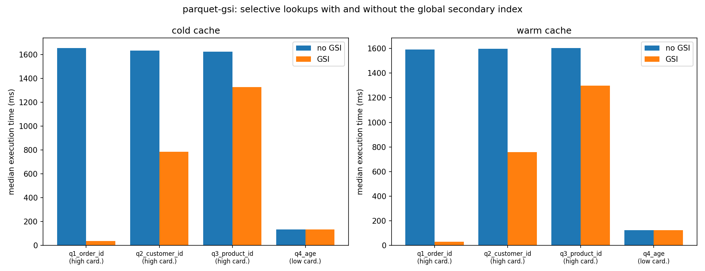

# Global Secondary Indices for Parquet Data Lakes

A global secondary index (GSI) for Parquet-backed foreign tables in PostgreSQL.
A point lookup on an unindexed data lake has to open every Parquet file and scan
every row group. This project keeps a `value -> (file, row group)` mapping in
PostgreSQL and teaches a modified `parquet_fdw` to consult it at plan time, so a
selective query opens one row group instead of forty-eight.

It works well on high-cardinality columns, poorly on low-cardinality ones, and
the index costs about four times the size of the data it indexes. All three of
those statements are measured below.

This work originated as a course project at IIT Bombay.

---

## Reproduce it

Three commands. Docker is the only prerequisite.

```bash
git clone https://github.com/HARSHIL2836R/Secondary-Indices-on-Data-Lakes.git
cd Secondary-Indices-on-Data-Lakes
./run_bench.sh
```

That generates a ~220 MB Parquet lake, builds four global secondary indexes,
proves the A/B toggle changes the query plan, runs the benchmark, and writes
every artifact under `results/`.

On the machine in [`results/hardware.json`](results/hardware.json): **1m47s** for
the one-time image build (Debian packages, Apache Arrow, and a `parquet_fdw`
compile) plus **4m10s** for the pipeline — **about 6 minutes end to end on a
cold clone**. Pass `medium` for a ~2 GB lake.

Everything runs inside the container. Nothing is installed on the host.

### What comes out

| File | What it is |
|---|---|
| `results/results.csv` | Every measurement, one row per (query, arm, cache, repetition). **Every number in this README comes from here.** |
| `results/results_table.md` | The table below, generated from that CSV |
| `results/latency.png` | The figure below |
| `results/explain_ab.txt` | Both query plans side by side, proving the A/B is real |
| `results/hardware.json` | The machine, the PostgreSQL settings, the Arrow version |
| `results/index_build.json` | Index build time and index size |

---

## Results

Measured on a 12th Gen Intel Core i5-12500H, 16 vCPU, 7.6 GiB RAM, PostgreSQL
16.14 in Docker, `shared_buffers=1GB`, `jit=off`,
`max_parallel_workers_per_gather=0`, Arrow C++ 24.0.0. Lake: 220 MB, 27 Parquet
files, 2,000,000 transactions across 24 files of 2 row groups each. Five
repetitions per cell; the figure reported is the median.

<!-- BEGIN results/results_table.md -->
| Query | Card. | Cache | No GSI (median ms) | GSI (median ms) | Speedup | Row groups read (no GSI -> GSI) | Rows returned | n |
|---|---|---|---|---|---|---|---|---|
| `q1_order_id` | high | cold | 1653.5 | 36.8 | 44.96x | 48 -> 1 | 1 | 5 |
| `q1_order_id` | high | warm | 1590.5 | 28.8 | 55.21x | 48 -> 1 | 1 | 5 |
| `q2_customer_id` | high | cold | 1631.9 | 783.2 | 2.08x | 48 -> 23 | 29 | 5 |
| `q2_customer_id` | high | warm | 1596.8 | 759.1 | 2.10x | 48 -> 23 | 29 | 5 |
| `q3_product_id` | high | cold | 1622.6 | 1327.4 | 1.22x | 48 -> 38 | 66 | 5 |
| `q3_product_id` | high | warm | 1604.2 | 1299.5 | 1.23x | 48 -> 38 | 66 | 5 |
| `q4_age` | low | cold | 134.3 | 135.1 | 0.99x (within run-to-run spread) | 4 -> 4 | 3246 | 5 |
| `q4_age` | low | warm | 123.3 | 122.4 | 1.01x (within run-to-run spread) | 4 -> 4 | 3246 | 5 |
<!-- END results/results_table.md -->



**Index build cost**, from [`results/index_build.json`](results/index_build.json):
72.9 s to index 26 files with 8 worker processes, producing 4,609,412 posting
rows totalling 896 MiB — for a 221 MiB lake. **The index is 4.1x the size of the
data it indexes.** `gsi_transactions_order_id` alone is 389 MiB of postings —
one posting row per transaction, because `order_id` is unique — to index
208 MiB of transaction Parquet.

### Read the row-groups column, not the speedup column

The speedup is a consequence; row-group pruning is the mechanism. `q1` prunes 48
row groups to 1 and goes 55x faster. `q4` prunes 4 to 4 — nothing — and so
neither gains nor loses. There is no case here where the index made a query
faster without pruning row groups, which is the result you want if you believe
the mechanism is doing what it claims.

### `q4_age` is a deliberate negative control

`customers.age` has 62 distinct values across 200,000 rows in 2 files of 2 row
groups. Every age appears in every row group, so the index has a posting for
every row group and prunes nothing. It is in the suite precisely because it is
the case where this design cannot help, and it stays in the suite whatever it
reports. On this run it is a wash — 122.4 ms against 123.3 ms warm, well inside
the run-to-run spread of both arms. On a larger lake, or with an index whose
postings do not fit in cache, the lookup would become pure overhead and this row
would turn negative. **A global secondary index on a low-cardinality column is
not worth building.**

### About the 7.7x figure in earlier versions of this document

Earlier revisions of this README claimed **~7.7x (2,461 ms -> 318 ms)** as the
headline result. **That number is withdrawn.** It cannot be reproduced from this
repository: no committed script produces it, the hardware it was measured on was
never recorded, and it is contradicted by the repo's own `results.txt`, which
logs roughly 16x, 2.7x, 1.4x and a 0.5x regression on a smaller lake. The table
above replaces it in full. Do not cite 7.7x.

The numbers in the table above are also not the same experiment as `results.txt`
and should not be reconciled with it: different lake size, different machine,
different queries, unrecorded methodology on that side.

---

## How the A/B works

There is no `enable_gsi` GUC. The FDW decides at plan time by querying
`public.gsi_registry` for the scanned table's OID
([`parquet_impl.cpp:1033`](modified_parquet_fdw/src/parquet_impl.cpp)). So
[`bench/gsi_off.sql`](bench/gsi_off.sql) moves every registry row into a holding
table and [`bench/gsi_on.sql`](bench/gsi_on.sql) moves it back. The postings
tables themselves are never dropped — only the planner's view of them changes.
That means the "no GSI" arm still pays for the index's disk footprint, which is
the honest comparison.

Because that mechanism is indirect, it is verified rather than assumed.
[`bench/verify_ab.py`](bench/verify_ab.py) runs before the benchmark and exits
non-zero if the two arms produce the same plan; `bench/plot.py` refuses to build
a table from a CSV whose `gsi_active` column disagrees with its `arm` column.
For `q1_order_id`:

```
                                  no GSI                     GSI
Global Secondary Index            (absent)                   Active (B+ Tree Filter)
Reader                            Multifile                  Single File
Row groups read                   48                         1
Rows removed by filter            1,999,999                  33,332
```

Full plans for all four queries: [`results/explain_ab.txt`](results/explain_ab.txt).

---

## How it works

**Index build** — [`bench/index_lake.py`](bench/index_lake.py) walks each
registered lake path, reads each Parquet file row group by row group via
[`watcher/extractor.py`](watcher/extractor.py), and writes
`(indexed_val, file_id, rowgroup_ids[])` into a per-index table. It then runs
`ANALYZE`, because the FDW's cost estimator reads `pg_statistic` for `ndistinct`
and falls back to `sqrt(selectivity)` without it.

In production this job is a long-running filesystem watcher
([`watcher/watcher_deamon.py`](watcher/watcher_deamon.py)) that reacts to file
creation and deletion. A benchmark cannot wait for a daemon to reach a steady
state at an unknown time, so `index_lake.py` does the same work in one pass and
exits. It reuses the daemon's extractor, so the postings are identical.

**Planning** — `parquetGetForeignPaths` looks up the registry, checks whether
any restriction clause is an equality on an indexed column, and if so adds a
second `ForeignScan` path alongside the full-scan path, costed by
`run_cost * selectivity/ndistinct`. The planner picks between them normally.

**Execution** — if the GSI path wins, `parquetBeginForeignScan` queries the
postings table for the literal, joins to `gsi_file_catalog`, and replaces the
scan's file list and row-group list with just the matching ones.

**Metadata tables** — `gsi_registry` (index definitions), `gsi_file_catalog`
(files and their ids), `gsi_index_file_state` (per-file index progress).

---

## Limitations

This section is the honest part. It gets longer as we learn more, never shorter.

### Found by running the benchmark

1. **`data/generate.py --seed 42` does not produce a reproducible lake.**
   `id_pool` ([`data/generate.py:265`](data/generate.py)) draws identifiers from
   `os.urandom`, which ignores `np.random.seed`. Row counts, ages, regions,
   amounts and timestamps are reproducible; `order_id`, `customer_id` and
   `product_id` — the three columns the high-cardinality indexes are built on —
   are freshly random on every run. A stranger re-running `./run_bench.sh` will
   therefore get a *statistically comparable* result, not an identical one.
   Observed on this machine: two consecutive runs of the identical command chose
   different `product_id` literals whose postings spanned 33 and 38 row groups
   respectively, moving that query's warm speedup from 1.45x to 1.23x. Only the
   second run's CSV is committed, and only its numbers appear in the table above.
   `q1_order_id` is insensitive to this because a unique key always resolves to
   exactly one row group. `q2` and `q3` are not.

2. **"Cold" does not mean cold storage.** The container has no `CAP_SYS_ADMIN`,
   so it cannot drop the host page cache, and PostgreSQL offers no supported way
   to evict `shared_buffers` from SQL — a large sequential scan deliberately uses
   a small ring buffer so that it will not. "Cold" here means a brand-new backend
   executing the query for the first time; "warm" means the same backend after a
   discarded warm-up execution. Parquet bytes read by an earlier repetition are
   very likely still in the VM's page cache. The cold and warm columns differ by
   only a few percent for exactly this reason, and neither should be read as a
   cold-storage number.

3. **The index is larger than the data.** 896 MiB of postings for a 221 MiB
   lake. A per-row posting on a unique key (`order_id`: 2,000,000 postings for
   2,000,000 rows) is close to the worst case a design like this can have, and
   nothing here compresses or de-duplicates postings. At the `large` target this
   would not fit in memory alongside the data.

4. **`q2` and `q3` use the most frequent value, not a typical one.**
   [`bench/queries.py`](bench/queries.py) picks the hottest `customer_id` and
   `product_id` deliberately: the hottest value has postings in the most row
   groups, so it is the value the index helps least. Those two speedups are a
   lower bound. A typical value would look better, and it would also be a less
   honest benchmark.

5. **Benchmarked on a laptop under WSL2**, not on server hardware or against
   object storage. All figures are single-machine, local-filesystem, PostgreSQL
   `Execution Time` from `EXPLAIN ANALYZE`. See `results/hardware.json`.

### Known design limitations

6. **The planner never checks `gsi_registry.status`.** The SPI query at
   [`parquet_impl.cpp:1033`](modified_parquet_fdw/src/parquet_impl.cpp) selects
   on `foreigntable_oid` alone, so an index still in `building` state is used as
   if it were `ready`. A query running during an index build can therefore miss
   rows silently — it will read only the files indexed so far and return a
   confidently wrong answer. Nothing in the benchmark hits this, because
   `index_lake.py` completes before any query runs, but it is a correctness bug,
   not a performance one.

7. **A file present in the lake but absent from `gsi_file_catalog` is invisible
   to the GSI path.** The executor replaces the scan's file list with whatever
   the postings join returns. There is no reconciliation step verifying that the
   catalogue covers the lake, so a missed file produces missing rows rather than
   an error.

8. **Only equality clauses on a single indexed column are used.**
   `extract_gsi_qual` handles one clause; multi-column predicates, ranges, `IN`
   lists and joins all fall back to the full scan.

9. **No concurrency or update story is measured.** Every number here is a
   read-only query against a static lake. The watcher daemon's behaviour under
   concurrent writes, its recovery from a crash mid-index, and the cost of
   keeping postings current under a write workload are all unmeasured.

10. **`n=5` per cell, one machine, one run.** Enough to show that the run-to-run
    spread is small (a few percent) and much smaller than the effects reported,
    but it is not a statistical study, and there are no confidence intervals.

11. **Only the `small` target is published.** The `medium` (2 GB) and `large`
    (10 GB) paths exist in the generator and are untested against the acceptance
    budget here.

12. **The Arrow pin has a shelf life.** `docker/Dockerfile` pins
    `libarrow-dev`/`libparquet-dev` to `24.0.0-1`, the version these numbers were
    produced against, so that a future Arrow API change surfaces as a deliberate
    version bump rather than a silent behaviour change. But Apache's apt
    repository only carries recent releases, so once 24.0.0 ages out the pinned
    build will fail to resolve the package. When that happens, bump the pin,
    rebuild, and **re-run `./run_bench.sh`** — do not bump the pin and keep these
    numbers.

---

## Repository layout

```
bench/                      the reproducible benchmark harness
  00_schema.sql             foreign tables, GSI metadata, four registered indexes
  gsi_on.sql / gsi_off.sql  the A/B toggle
  index_lake.py             one-shot deterministic index build
  queries.py                the four queries and their literals
  verify_ab.py              gate: fails if the two arms plan identically
  run_bench.py              2 arms x 4 queries x cold/warm x N reps -> results.csv
  plot.py                   CSV -> latency.png + results_table.md
data/generate.py            seeded Parquet lake generator (see Limitation 1)
docker/Dockerfile           PG16 + Arrow/Parquet + compiled parquet_fdw
modified_parquet_fdw/       the FDW, with GSI planner and executor integration
parquet_extraction_engine/  standalone C++ Parquet reader (not on the query path)
watcher/                    the production metadata watcher daemon
results/                    committed measurements
test/                       the original demo SQL this harness was derived from
```

---

## Licensing

This repository's own code is Apache-2.0; see [`LICENSE`](LICENSE).

**`modified_parquet_fdw/` is not Apache-2.0.** It derives from
[`adjust/parquet_fdw`](https://github.com/adjust/parquet_fdw), Copyright (c)
2018-2019 adjust GmbH, and is governed by the permissive licence in
[`modified_parquet_fdw/LICENSE.md`](modified_parquet_fdw/LICENSE.md), which the
repository-root Apache-2.0 licence does not supersede. See [`NOTICE`](NOTICE).

---

## Team

<CONTRIBUTIONS-PENDING>
